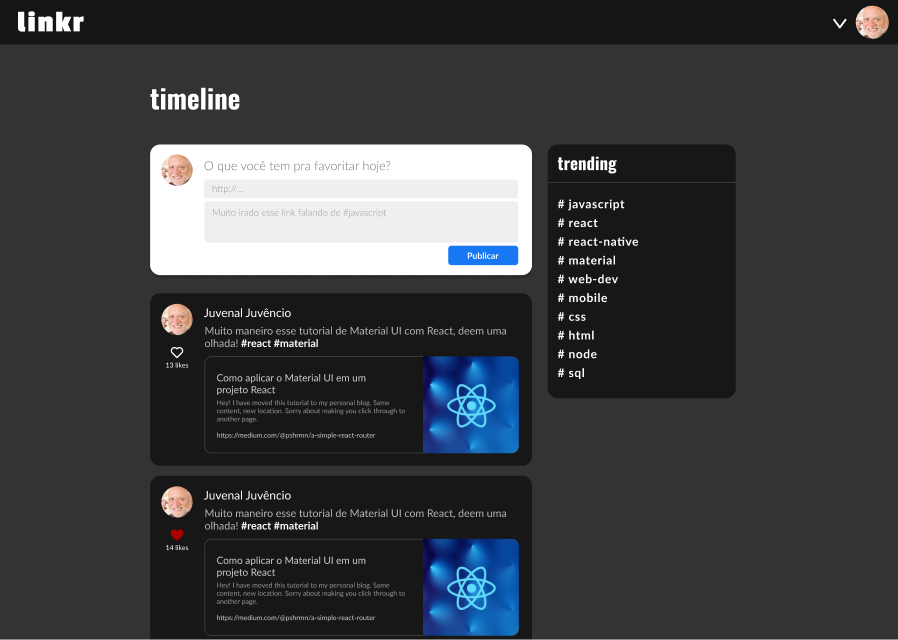

# 
# Linkr - Sharing Ideas
### Link sharing social networking service

<p align="center">
  
</p>

<p align="center">
   <a href="https://linkr-eight.vercel.app/">Click here</a> to acess the App
</p>

## About

This is an web application with which lots of people can share their links and interact. Below are the implemented features:

- Sign Up
- Login
- Follow users
- Followed user posts
- Like posts
- Comment posts
- Re-post
- Link preview
- My posts
- My liked post
- Link posting w/ or w/o geolocation

## Technologies

### The following tools and frameworks were used in the construction of the project:
|HTML|CSS|JavaScript|ReactJS|
|-|-|-|-|
|[<p align="center"></p>][html]|[<p align="center"></p>][css]|[<p align="center"></p>][es6]|[<p align="center"></p>][react]|
|JSX syntax|CSS styling and styled components|ECMAScript 2015 (ES6) features|React is a JavaScript library for building user interfaces, declarative and component-based|


[html]: https://www.w3schools.com/html/
[css]: https://www.w3schools.com/css/
[es6]: https://262.ecma-international.org/6.0/
[react]: https://reactjs.org/


## How to run

1. Clone this repository
2. Install dependencies
```bash
npm i
```
3. Run with
```bash
npm start
```
4. Finally access http://localhost:3000 on your favorite browser
